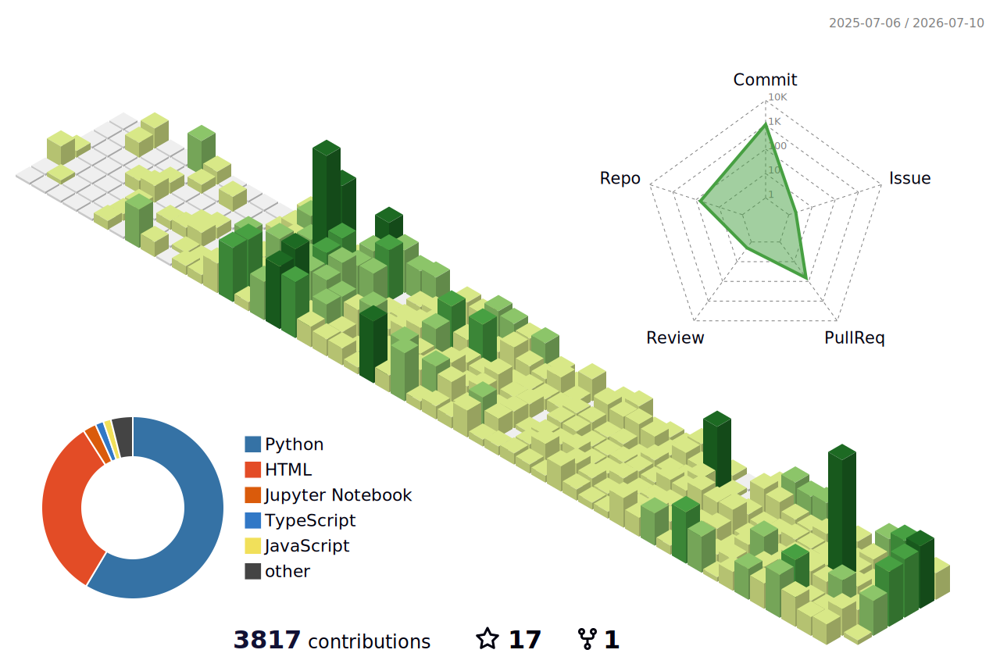
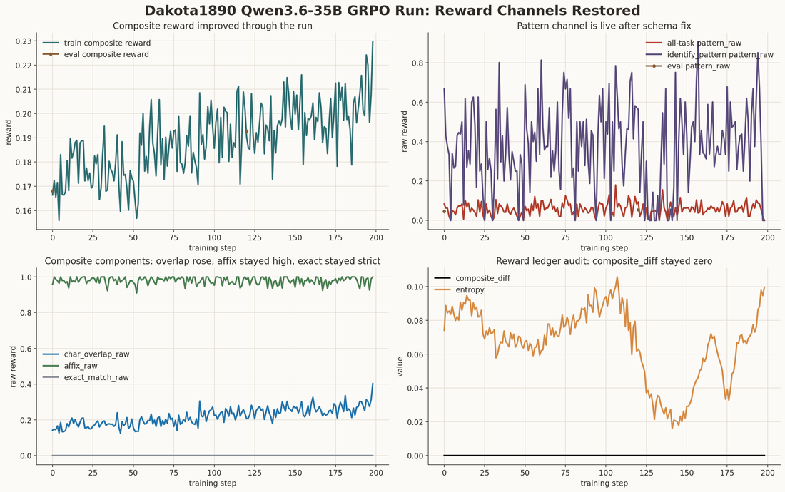
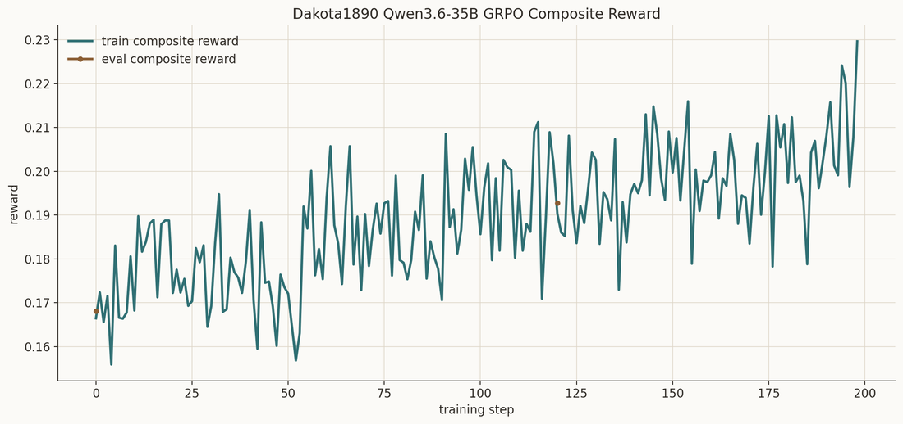
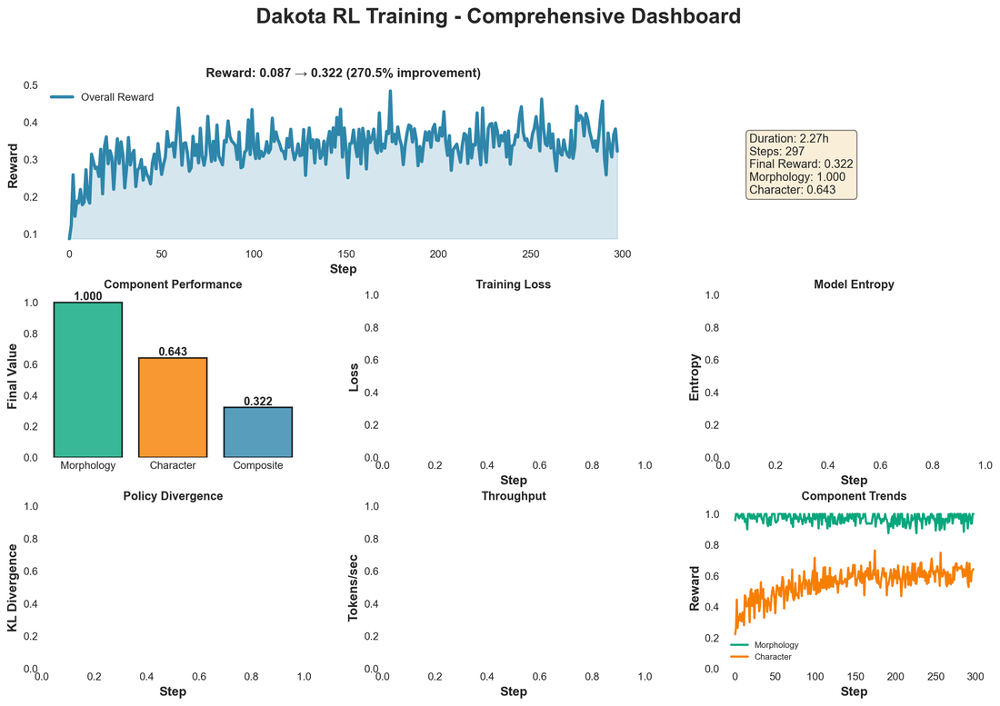
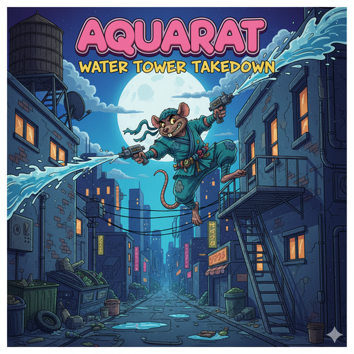
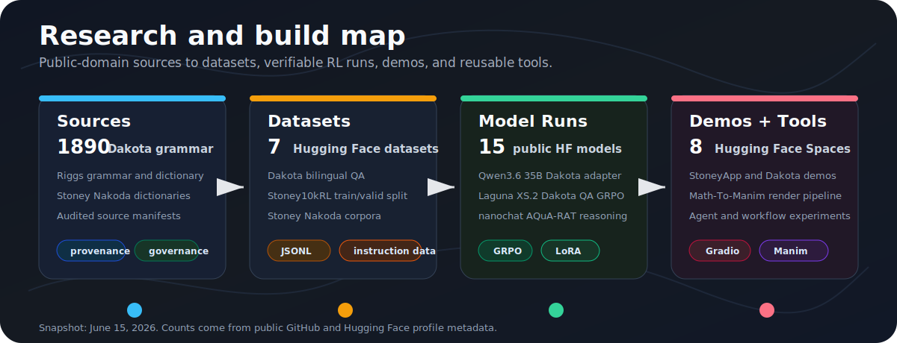
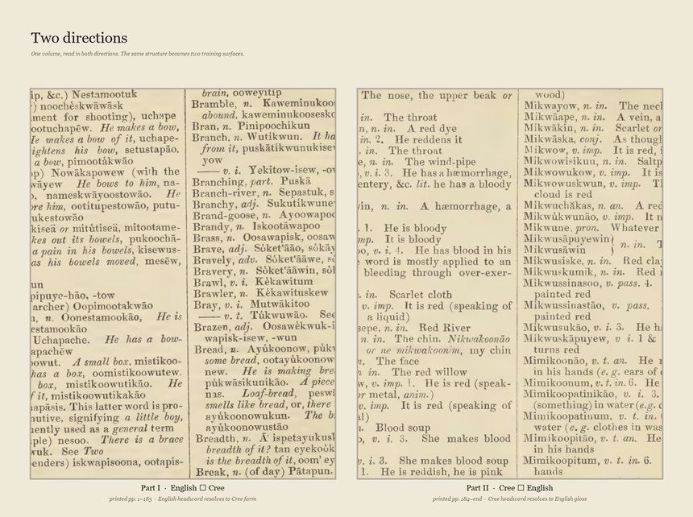
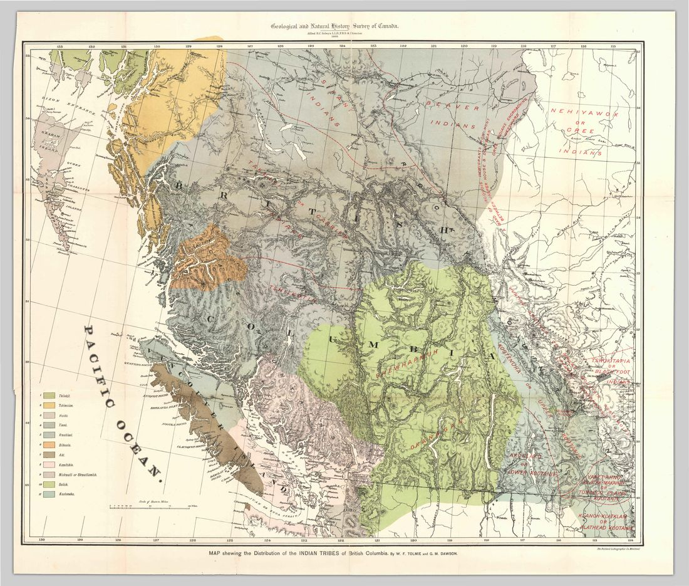

<!-- Badges + counters (kept at top) -->
<p align="center">
  <a href="https://github.com/HarleyCoops"></a>
  <a href="https://huggingface.co/HarleyCooper"></a>
  <a href="https://wandb.ai/christian-cooper-us"></a>
  <a href="https://linkedin.com/in/christianhcooperus"></a>
  <a href="https://twitter.com/christiancooper"></a>
  <a href="https://kaggle.com/christianhcooper"></a>
</p>

<p align="center">
  
  
  
  
</p>

<p align="center">
  
</p>

---

## The Short Version

I build **verifiable training loops**: pipelines that turn a single historical source — an 1890 Dakota grammar, an 1865 Cree dictionary, a 1959 railroad rulebook — into extracted rules, labeled tasks, deterministic reward functions, and published models. Plus the project's other half: **Math-To-Manim** ( 2,400+), a prompt-to-animation engine that turns questions into computed mathematical film.

<table>
  <tr>
    <td align="center" width="20%"><strong>703</strong><br/>public repos</td>
    <td align="center" width="20%"><strong>2,400+</strong><br/>stars on Math-To-Manim</td>
    <td align="center" width="20%"><strong>17 / 8 / 7</strong><br/>HF models, datasets, Spaces</td>
    <td align="center" width="20%"><strong>82M+</strong><br/>tokens through one GRPO run</td>
    <td align="center" width="20%"><strong>3</strong><br/>languages brought to RL</td>
  </tr>
</table>

**What I do that employers actually hire for:**

- **Model training & fine-tuning** — GRPO / RL post-training with deterministic, decomposed reward functions; LoRA adapters from 0.5B to 35B on Tinker and Prime Intellect; full run cards, reward ledgers, and audits published on Hugging Face and W&B.
- **Data labeling & dataset engineering** — VLM extraction from archival scans, orthography-preserving labeling, synthetic Q&A expansion, structural holdouts, hash-addressed dataset artifacts with citations intact.
- **Reward/verifier design** — grammar rules compiled into executable, per-component reward channels (no LLM judge; every gradient is inspectable).
- **Visualization that explains** — Manim render pipelines, RL training-curve dashboards, LiDAR terrain viewers.

---

## The Movie Wall — Math-To-Manim

**Ask a question → get a freakin' movie.** Nothing keyframed — every frame is integrated, simulated, or derived. 2,400+ stars.

<table>
  <tr>
    <td width="33%">
      <a href="https://github.com/HarleyCoops/Math-To-Manim">
        
      </a>
      <p align="center"><strong>The Traitor Axis</strong><br/>Rigid-body chaos from RK4 integration — predicted flip at 3.4 s, simulated at 3.5 s.</p>
    </td>
    <td width="33%">
      <a href="https://github.com/HarleyCoops/Math-To-Manim/tree/main/docs/showcase">
        
      </a>
      <p align="center"><strong>The Last Day</strong><br/>One continuous 3D take: sphere → torus → helicoid → catenoid → Lorenz.</p>
    </td>
    <td width="33%">
      <a href="https://github.com/HarleyCoops/Math-To-Manim/tree/main/docs/showcase">
        
      </a>
      <p align="center"><strong>Vortex Leapfrog</strong><br/>Two rings leapfrogging, simulated live by Biot-Savart integration.</p>
    </td>
  </tr>
  <tr>
    <td width="33%">
      
      <p align="center"><strong>Archimedean solids</strong></p>
    </td>
    <td width="33%">
      
      <p align="center"><strong>Lorenz attractor</strong></p>
    </td>
    <td width="33%">
      
      <p align="center"><strong>Volatility surface</strong> — options intuition in motion</p>
    </td>
  </tr>
</table>

<p align="center">
  <a href="https://github.com/HarleyCoops/Math-To-Manim"></a>
  <a href="https://github.com/HarleyCoops/KimiK3Manim"></a>
  <a href="https://github.com/HarleyCoops/Math-To-Manim/tree/main/docs/showcase"></a>
</p>

---

## The Training Lab — GRPO on Things Nobody Tries

The signature move: **grammar as a reward function**. Take a source document, compile its rules into verifiable tasks, and let GRPO optimize against per-component reward channels — orthography, morphology, semantics — with zero LLM-judge fuzz. The reward ledger reconciles to the step.

```python
reward = (
    0.4 * character_preservation +   # orthography: ŋ š ć ḣ preserved?
    0.4 * affix_accuracy +           # morphology: correct affixes applied?
    0.2 * semantic_correctness       # semantics: meaning vs. ground truth
) * difficulty_multiplier            # curriculum weight, 1.0x → 2.0x
```

<table>
  <tr>
    <td width="50%">
      <a href="https://huggingface.co/HarleyCooper/Qwen3.6-35B-A3B-Dakota1890-GRPO"></a>
      <p align="center"><strong>Qwen3.6-35B Dakota GRPO</strong> — 82.05M tokens, composite reward climbing, ledger audit flat at zero.</p>
    </td>
    <td width="50%">
      <a href="https://wandb.ai/christian-cooper-us"></a>
      <p align="center"><strong>Reward progression</strong> — every channel logged per step on Weights &amp; Biases.</p>
    </td>
  </tr>
  <tr>
    <td width="50%">
      <a href="https://github.com/HarleyCoops/Qwen3-RailroadEngineer1959-RL"></a>
      <p align="center"><strong>Railroad Engineer 1959</strong> — a rulebook becomes a training environment.</p>
    </td>
    <td width="50%">
      <a href="https://github.com/HarleyCoops/nanochatAquaRat"></a>
      <p align="center"><strong>nanochat × AQuA-RAT</strong> — small-model algebra reasoning, end-to-end RL.</p>
    </td>
  </tr>
</table>

### Published model runs

| Model | Params | Method | Verified result |
|---|---:|---|---|
| [Laguna-XS.2-Adaption-Dakota-QA-GRPO](https://huggingface.co/HarleyCooper/Laguna-XS.2-Adaption-Dakota-QA-GRPO) | XS | GRPO, Prime Hosted Training | Reward **0.283 → 0.433**, char-F1 **0.327 → 0.635** |
| [Qwen3.6-35B-A3B-Dakota1890-GRPO](https://huggingface.co/HarleyCooper/Qwen3.6-35B-A3B-Dakota1890-GRPO) | 35B | GRPO, Tinker | **82.05M tokens**, audited reward channels |
| [Cree1865](https://huggingface.co/HarleyCooper/Cree1865) | 30B-A3B | Modified GRPO, Tinker | 800-step synthetic-expansion run, [live W&B](https://wandb.ai/christian-cooper-us/thinking-machines-qwen3-30b/runs/hda2wqhl) |
| [Qwen3-4B-RailRoadEngineer1959](https://huggingface.co/HarleyCooper/Qwen3-4B-RailRoadEngineer1959) | 4B | LoRA, volume2gym lineage | Rulebook-compiled task families |
| [Qwen3-0.6B-Dakota-Grammar-RL-400](https://huggingface.co/HarleyCooper/Qwen3-0.6B-Dakota-Grammar-RL-400) | 0.6B | GRPO, Prime Intellect | 400 steps, **+150% reward**, 97.9% morphology accuracy |
| [nanochat-AquaRat](https://huggingface.co/HarleyCooper/nanochat-AquaRat) | nano | RL, AQuA-RAT | GSM8K-style → multiple-choice algebra |

<p align="center">
  <a href="https://github.com/HarleyCoops/Math-To-Manim"></a>
  <a href="https://github.com/HarleyCoops/Dakota1890"></a>
</p>
<p align="center">
  <a href="https://github.com/HarleyCoops/volume2gym"></a>
  <a href="https://github.com/HarleyCoops/Cree1865"></a>
</p>

---

## Data Labeling & Dataset Engineering — Book → Gym → Model

[**volume2gym**](https://github.com/HarleyCoops/volume2gym) is the general compiler behind the language work: **any structured volume becomes an RL gym**. Sections name the world, rules constrain action, procedures encode order, exceptions define edge cases. The compiler emits cited knowledge units, six task families, grouped holdouts, deterministic reward ledgers, and SFT/GRPO trainer exports — hash-addressed and tamper-evident.

| Task family the compiler emits | What it tests |
|---|---|
| `standard_operation` | Correct ordinary application |
| `edge_case` | Boundary conditions and missing facts |
| `conflict_resolution` | Compatible resolution of constraints |
| `exception_handling` | Exception triggers vs. normal boundaries |
| `violation_check` | Missing requirements, forbidden actions, bad order |
| `adversarial_distractor` | Rejection of plausible but unsupported instructions |

The 1959 *Consolidated Code of Operating Rules* lineage: **536 extracted rules → 2,708 scenarios** → gym → [Qwen3-4B adapter](https://huggingface.co/HarleyCooper/Qwen3-4B-RailRoadEngineer1959) → [Rule 99 contract fixture](https://huggingface.co/datasets/HarleyCooper/volume2gym-railroad-1959) on Hugging Face.

### Labeled datasets on the Hub

| Dataset | What it is | Shape |
|---|---|---|
| [adaption-dakota-english-qa](https://huggingface.co/datasets/HarleyCooper/adaption-dakota-english-qa) | Remastered Dakota–English QA for instruction tuning & GRPO | 1,953 examples |
| [dakota-bilingual-qa](https://huggingface.co/datasets/HarleyCooper/dakota-bilingual-qa) | Bilingual QA pairs from the 1890 dictionary | 2,445 examples, train/val |
| [Stoney10kRL](https://huggingface.co/datasets/HarleyCooper/Stoney10kRL) | 2026 Stoney Nakoda RL fine-tuning package | 8,000 train / 2,000 val |
| [StoneyNakoda45k](https://huggingface.co/datasets/HarleyCooper/StoneyNakoda45k) | Community-in-the-loop language dataset | 25–50K size class |
| [volume2gym-railroad-1959](https://huggingface.co/datasets/HarleyCooper/volume2gym-railroad-1959) | Rule 99 artifact-contract fixture with ledgers | 6 train / 1 held-out |
| [synthetic_stoney_data](https://huggingface.co/datasets/HarleyCooper/synthetic_stoney_data) | Synthetic Q&A bootstrap resource | JSONL |

<p align="center">
  
</p>

---

## The Archive — Handwriting, Letterpress, and Self-Training Models

A research line in three languages: **give an endangered language one good historical book, and train.** VLM extraction reads the scans — diacritics, letterpress ligatures, and all — then synthetic Q&A multiplies the surface area, then GRPO with a rubric built from the book itself. The final stage belongs to the community: speakers correct the model, and the corrections become the next training round. The model is a toddler that has read the book cover to cover; the community teaches it the rest.

<table>
  <tr>
    <td width="33%">
      <a href="https://github.com/HarleyCoops/Cree1865"></a>
      <p align="center"><strong>Cree1865</strong> — Watkins' 1865 dictionary, 98 pages sampled</p>
    </td>
    <td width="33%">
      <a href="https://github.com/HarleyCoops/Cree1865"></a>
      <p align="center"><strong>The marks that make it Cree</strong> — diacritics as verifiable signal</p>
    </td>
    <td width="33%">
      <a href="https://github.com/HarleyCoops/Cree1865"></a>
      <p align="center"><strong>Two directions</strong> — English→Cree and Cree→English</p>
    </td>
  </tr>
  <tr>
    <td width="50%">
      <a href="https://github.com/HarleyCoops/Dakota1890"></a>
      <p align="center"><strong>Dakota1890</strong> — Riggs' 1890 grammar: 1,497 rules → 10,576 verifiable tasks</p>
    </td>
    <td width="50%">
      <a href="https://github.com/HarleyCoops/StoneyNakoda"></a>
      <p align="center"><strong>StoneyNakoda</strong> — Dawson's Bow Valley survey; the community-in-the-loop origin</p>
    </td>
  </tr>
</table>

| Project | Source volume | Public artifacts |
|---|---|---|
| [Dakota1890](https://github.com/HarleyCoops/Dakota1890) | Riggs 1890 *Grammar & Dictionary of the Dakota Language* | [35B adapter](https://huggingface.co/HarleyCooper/Qwen3.6-35B-A3B-Dakota1890-GRPO) · [Laguna run card](https://huggingface.co/HarleyCooper/Laguna-XS.2-Adaption-Dakota-QA-GRPO) |
| [Cree1865](https://github.com/HarleyCoops/Cree1865) | Watkins 1865 *Dictionary of the Cree Language* | [HF model](https://huggingface.co/HarleyCooper/Cree1865) · [W&B run](https://wandb.ai/christian-cooper-us/thinking-machines-qwen3-30b/runs/hda2wqhl) · [explained dashboard](https://wandb.ai/christian-cooper-us/thinking-machines-qwen3-30b/reports/Cree1865-Synthetic-Expansion-V1-Explained-Dashboard--VmlldzoxNzM1MDY2MQ==) · [inference Space](https://huggingface.co/spaces/HarleyCooper/Cree1865-Tinker-Inference) |
| [StoneyNakoda](https://github.com/HarleyCoops/StoneyNakoda) | Contemporary speakers + historical survey material | [Stoney10kRL](https://huggingface.co/datasets/HarleyCooper/Stoney10kRL) · [StoneyApp](https://huggingface.co/spaces/HarleyCooper/StoneyApp) |
| [Railroad Engineer 1959](https://github.com/HarleyCoops/Qwen3-RailroadEngineer1959-RL) | 1959 *Consolidated Code of Operating Rules* | [Qwen3-4B LoRA](https://huggingface.co/HarleyCooper/Qwen3-4B-RailRoadEngineer1959) · [dataset fixture](https://huggingface.co/datasets/HarleyCooper/volume2gym-railroad-1959) |

Handwriting and OCR lineage runs through the repo list too — [PyLaia](https://github.com/HarleyCoops/PyLaia) (handwritten document analysis), [deepseek-ocr](https://github.com/HarleyCoops/deepseek-ocr), [olmocr](https://github.com/HarleyCoops/olmocr) (PDF linearization for training data), and a reproduction of [LeCun 1989 handwritten zip-code recognition](https://github.com/HarleyCoops/lecun1989-repro) — the ancestor of all of this.

---

## Alberta Geospatial & Agent Tooling

| Project | What it shows |
|---|---|
| [lidar2](https://github.com/HarleyCoops/lidar2) | Map-driven LiDAR visualizer — OpenTopography DEM → multi-layer 3D terrain point clouds (React, Three.js, custom GLSL elevation shaders) |
| [maplibre-gl-lidar](https://github.com/HarleyCoops/maplibre-gl-lidar) | MapLibre plugin for visualizing LiDAR point clouds |
| [openArchive](https://github.com/HarleyCoops/openArchive) | Research UX over BC & Alberta archive collections |
| [AlbertaWorkspaceAgent](https://github.com/HarleyCoops/AlbertaWorkspaceAgent) | Agent-native workspace experiments for Alberta research workflows |

---

## Hugging Face Hub

<p>
  <a href="https://huggingface.co/HarleyCooper"></a>
  <a href="https://huggingface.co/models?author=HarleyCooper"></a>
  <a href="https://huggingface.co/datasets?author=HarleyCooper"></a>
  <a href="https://huggingface.co/spaces?author=HarleyCooper"></a>
</p>

| Live demos (Spaces) | Try it |
|---|---|
| [StoneyApp](https://huggingface.co/spaces/HarleyCooper/StoneyApp) | Stoney Nakoda community-in-the-loop app |
| [Cree1865-Tinker-Inference](https://huggingface.co/spaces/HarleyCooper/Cree1865-Tinker-Inference) | Sample from the Cree1865 training run |
| [Dakota-.6B](https://huggingface.co/spaces/HarleyCooper/Dakota-.6B) | Dakota grammar RL demo |
| [AskAboutCIL](https://huggingface.co/spaces/HarleyCooper/AskAboutCIL) | Community-in-the-loop method explainer |

## Weights & Biases

Every training run ships with its curves public — reward channels, entropy, ledger audits, per-step components.

<p>
  <a href="https://wandb.ai/christian-cooper-us"></a>
  <a href="https://wandb.ai/christian-cooper-us/thinking-machines-qwen3-30b/runs/hda2wqhl"></a>
  <a href="https://wandb.ai/christian-cooper-us/dakota-rl-grammar/runs/7nikv4vp"></a>
  <a href="https://wandb.ai/christian-cooper-us/thinking-machines-qwen3-30b/reports/Cree1865-Synthetic-Expansion-V1-Explained-Dashboard--VmlldzoxNzM1MDY2MQ=="></a>
</p>

---

## Stack

<p>
  
</p>
<p>
  
  
  
  
  
  
  
  
  
</p>

---

## Market Wire

*Live — refreshed every 6 hours by a GitHub Action from CNBC, Reuters, and FT feeds.*

<!-- NEWS:START -->
| Category | Date | Headline |
|----------|------|----------|
| Market | Jul 22, 2026 | [John Paulson says we are in the early stages of a long-term bull market for gold](https://www.cnbc.com/2026/07/22/john-paulson-says-we-are-in-early-stages-of-a-long-term-bull-market-for-gold.html) |
| Market | Jul 22, 2026 | [Kalshi launches election hub for prediction markets ahead of midterms](https://www.cnbc.com/2026/07/22/kalshi-launches-election-hub-for-prediction-markets-ahead-of-midterms.html) |
| Market | Jul 21, 2026 | [Goldman Sachs creates private markets platform as rich investors seek the next SpaceX and Stripe](https://www.cnbc.com/2026/07/21/goldman-sachs-private-markets-platform.html) |
| Market | Jul 21, 2026 | [Bets against SpaceX grow to 32% of float as Elon Musk warns short sellers won't survive](https://www.cnbc.com/2026/07/21/bets-against-spacex-grow-to-32percent-of-float-as-elon-musk-warns-short-sellers-wont-survive.html) |
| Market | Jul 21, 2026 | [As the U.S.-Iran war heats up again, these parts of the stock market and economy could be affected](https://www.cnbc.com/2026/07/21/iran-war-economy-markets-trump.html) |
| Finance | Jul 22, 2026 | [Google burns through $6bn in cash as AI spending climbs again](https://www.ft.com/content/b02f972c-c764-4006-9377-42563d9d5530?syn-25a6b1a6=1) |
| Finance | Jul 23, 2026 | [How to be a bull on the S&P 500](https://www.ft.com/content/b3e67789-9470-47c1-b984-a3e9c8d731a1?syn-25a6b1a6=1) |
| Finance | Jul 23, 2026 | [Tesla’s profits plunge as Musk’s carmaker uses discounts to boost sales](https://www.ft.com/content/dc5e629b-562c-41e3-8b89-350af6960adc?syn-25a6b1a6=1) |
| Finance | Jul 23, 2026 | [Japan awakes](https://www.ft.com/content/397c04d8-db0f-4902-9ea0-269584f43697?syn-25a6b1a6=1) |
| Finance | Jul 23, 2026 | [Military briefing: can the US reopen the Strait of Hormuz by force?](https://www.ft.com/content/1cbe4fd0-6b81-42c5-bc30-070fec3cd9dd?syn-25a6b1a6=1) |

<!-- NEWS:END -->

---

## GitHub Analytics

<details open>
  <summary><strong>Open stats dashboards</strong></summary>

  <p align="center">
    
  </p>

  <p align="center">
    
    
  </p>

  <p align="center">
    
  </p>

  <p align="center">
    
  </p>
</details>

<details>
  <summary><strong>Star history — Math-To-Manim</strong></summary>
  <p align="center">
    <a href="https://www.star-history.com/?repos=HarleyCoops%2FMath-To-Manim&type=date&legend=top-left">
      
    </a>
  </p>
</details>

---

## Receipts

<details>
  <summary>Small artifacts I keep around</summary>

  <p align="center">
    
  </p>

  <p align="center">
    
  </p>
</details>

---

## Connect

<p align="center">
  <a href="https://github.com/HarleyCoops">GitHub</a> ·
  <a href="https://huggingface.co/HarleyCooper">Hugging Face</a> ·
  <a href="https://wandb.ai/christian-cooper-us">Weights &amp; Biases</a> ·
  <a href="https://linkedin.com/in/christianhcooperus">LinkedIn</a> ·
  <a href="https://twitter.com/christiancooper">X</a> ·
  <a href="https://kaggle.com/christianhcooper">Kaggle</a>
</p>

<p align="center"><em>Open source is the portfolio. The best entry points are the project READMEs, model cards, dataset cards, W&B runs, and demos linked above.</em></p>

<p align="center">
  
</p>
