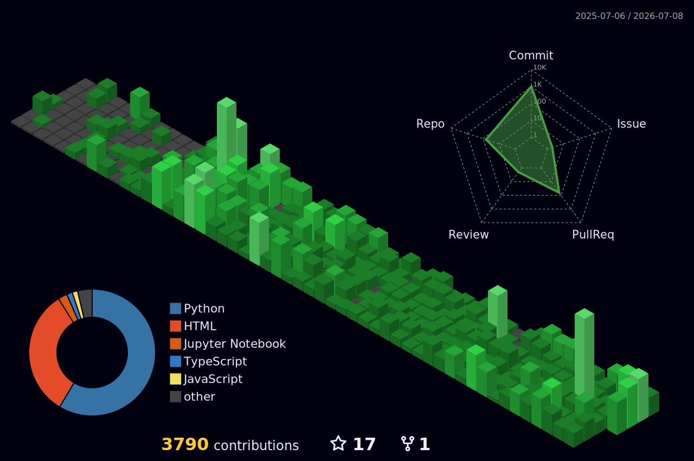
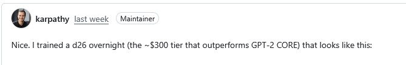
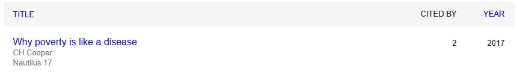

<h1 align="center">Christian H. Cooper</h1>
<p align="center"><em>Quant trader turned ML engineer. I train small models to do hard reasoning — and to speak endangered languages.</em></p>

<p align="center">
  
</p>

---

## Now

- Training **Qwen3-0.6B** on Dakota grammar via GRPO — fluent output from a 0.6B model on a language with <3k speakers.
- Extending the **Stoney Nakoda** corpus past 68k synthetic + 14.5k real rows.
- Building **Manim** animations as reasoning benchmarks for small LLMs — if a model can render a 62-face recursive polyhedron, it can probably think.

---

## Selected Work

<table>
<tr>
<td width="50%" valign="top">

### Language preservation at model scale

Stoney Nakoda and Dakota each have fewer than 3,000 fluent speakers. I've built a bilingual corpus — 68.8k synthetic + 14.5k real rows — and fine-tuned Qwen3-0.6B with GRPO to produce grammatically correct Dakota output on commodity hardware.

<p>
  <a href="https://github.com/HarleyCoops/StoneyNakoda">StoneyNakoda repo</a> ·
  <a href="https://huggingface.co/HarleyCooper/Qwen3-0.6B-Dakota-Grammar-RL">Qwen3-0.6B-Dakota-Grammar-RL</a> ·
  <a href="https://huggingface.co/spaces/HarleyCooper/Dakota-.6B">live demo</a>
</p>

<sub><code>Qwen3-0.6B</code> · <code>GRPO</code> · <code>synthetic data</code> · <code>RLHF</code></sub>

</td>
<td width="50%" valign="top">

### Reasoning on tiny models

GRPO experiments on 0.5B-parameter bases, showing that structured reward shaping can coax real reasoning out of models small enough to run on a laptop. AQuA-RAT, GSM8K, and Open-R1 math traces.

<p>
  <a href="https://github.com/HarleyCoops/OneShotGRPO">OneShotGRPO</a> ·
  <a href="https://huggingface.co/HarleyCooper/nanochat-AquaRat">nanochat-AquaRat</a> ·
  <a href="https://huggingface.co/HarleyCooper/Qwen.5B-OpenR1Math">Qwen.5B-OpenR1Math</a>
</p>

<sub><code>Qwen2.5-0.5B</code> · <code>GRPO</code> · <code>AQuA-RAT</code> · <code>GSM8K</code></sub>

</td>
</tr>
<tr>
<td width="50%" valign="top">

<a href="https://github.com/HarleyCoops/Math-To-Manim">
  
</a>

### Math-To-Manim — animation as reasoning eval

A 62-face Archimedean solid where each vertex recursively contains another polyhedron. Most LLMs fail this on the coordinate math alone — which is precisely why it's a useful benchmark for code-gen reasoning.

<p><a href="https://github.com/HarleyCoops/Math-To-Manim">Math-To-Manim</a></p>

<sub><code>Manim</code> · <code>computational geometry</code> · <code>Python</code></sub>

</td>
<td width="50%" valign="top">

<a href="https://github.com/HarleyCoops/Math-To-Manim">
  
</a>

### Derivatives, made legible

Black-Scholes implied-volatility surface across strikes and maturities. The shape of the smile is the thing exotic pricing actually trades against — bringing a CFA background to bear on visualization.

<p><a href="https://github.com/HarleyCoops/Math-To-Manim">Math-To-Manim</a></p>

<sub><code>Black-Scholes</code> · <code>QuantLib</code> · <code>Manim</code></sub>

</td>
</tr>
</table>

---

## Published Models & Datasets

<p>
  <a href="https://huggingface.co/HarleyCooper">
    
  </a>
  &nbsp;<strong>9 models · 6 datasets · 6 Spaces</strong>
</p>

| Artifact | What it is | Link |
|---|---|---|
| **Qwen3-0.6B-Dakota-Grammar-RL** | Dakota grammar via GRPO, Qwen3-0.6B base | [model](https://huggingface.co/HarleyCooper/Qwen3-0.6B-Dakota-Grammar-RL) |
| **nanochat-AquaRat** | RL on algebraic reasoning (AQuA-RAT) | [model](https://huggingface.co/HarleyCooper/nanochat-AquaRat) |
| **Qwen.5B-OpenR1Math** | Open-R1 style math reasoning, 0.5B | [model](https://huggingface.co/HarleyCooper/Qwen.5B-OpenR1Math) |
| **dakota-bilingual-qa** | 2.45k Dakota-English Q&A pairs | [dataset](https://huggingface.co/datasets/HarleyCooper/dakota-bilingual-qa) |
| **synthetic_stoney_data** | 68.8k synthetic Stoney Nakoda rows | [dataset](https://huggingface.co/datasets/HarleyCooper/synthetic_stoney_data) |
| **StoneyNakoda** | 14.5k real Stoney Nakoda corpus | [dataset](https://huggingface.co/datasets/HarleyCooper/StoneyNakoda) |

```python
from transformers import AutoTokenizer, AutoModelForCausalLM
import torch

mdl = "HarleyCooper/Qwen3-0.6B-Dakota-Grammar-RL"
tok = AutoTokenizer.from_pretrained(mdl)
model = AutoModelForCausalLM.from_pretrained(mdl, torch_dtype=torch.float16, device_map="auto")
print(tok.decode(model.generate(**tok("Translate to Dakota:", return_tensors="pt").to(model.device), max_new_tokens=64)[0], skip_special_tokens=True))
```

---

## Tape

<sub>Auto-updated every 6 hours via GitHub Actions.</sub>

<!-- NEWS:START -->
| Category | Date | Headline |
|----------|------|----------|
| - | - | Pending first run of the news workflow |
<!-- NEWS:END -->

---

<details>
<summary><strong>Proof</strong> — cited on Google Scholar · publicly engaged with @karpathy</summary>
<br>
<p align="center">
  
</p>
<p align="center">
  
</p>
</details>

---

<p align="center">
  <a href="https://twitter.com/christiancooper">𝕏 @christiancooper</a> ·
  <a href="https://linkedin.com/in/christianhcooperus">LinkedIn</a> ·
  <a href="https://huggingface.co/HarleyCooper">Hugging Face</a> ·
  <a href="https://dev.to/harleycoops">dev.to</a> ·
  <a href="https://kaggle.com/christianhcooper">Kaggle</a>
</p>
