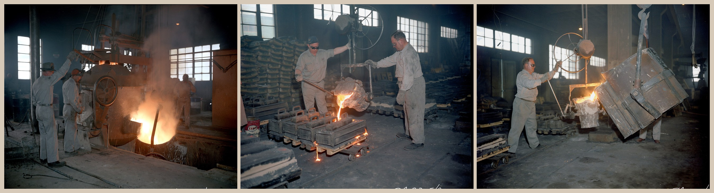
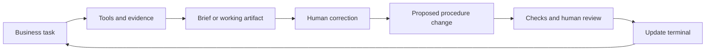
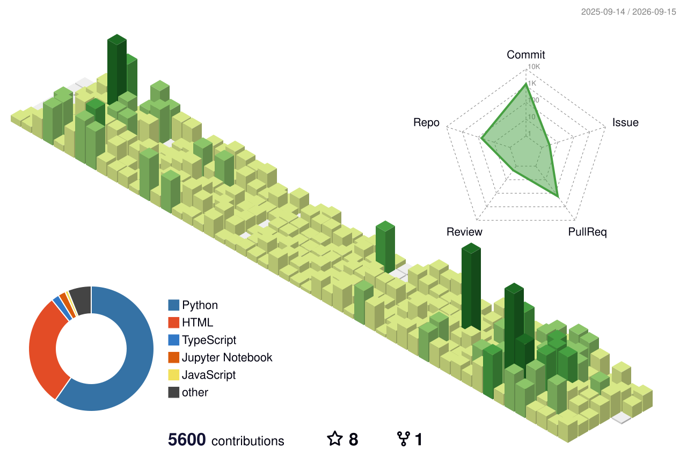

# Christian Harley Cooper

### AI for the people who build things.

I build and support AI workspaces for Canadian businesses through **Warre & Vavasour**. My current focus is **WorkspaceAlberta**: an onsite terminal, practical connections to industrial work, and a custom agent harness that turns an owner's ideas into files, documents, code, and usable workflows.

**“Wouldn't it be great if…” is where we start.** We build with the people already doing the work and help them do more.

[Discuss a deployment](mailto:hello@warreandvavasour.com?subject=WorkspaceAlberta%20deployment) · [WorkspaceAlberta](https://github.com/HarleyCoops/WorkspaceAlberta) · [Models & datasets](https://huggingface.co/HarleyCooper) · [LinkedIn](https://linkedin.com/in/christianhcooperus)

  

What Alberta makes makes Alberta. Foothills Steel Foundry, Calgary, 1963 — Provincial Archives of Alberta, PA3315.1–.3; no known copyright restrictions. Historical imagery, not a customer deployment. [Image sources](https://github.com/HarleyCoops/WorkspaceAlberta/blob/main/docs/imagery-sources.md).

## Put AI to work in your business

The first connection is procurement: help fabricators, manufacturers, contractors, and small teams find public work, understand the requirements, and decide what deserves an estimator's attention.

| A question from the business | What the workspace helps produce |
|---|---|
| “What government work fits our shop?” | Opportunities from CanadaBuys and Alberta Purchasing Connection, matched against the capabilities you supply. |
| “What closes soon, and what are we missing?” | A daily bid brief, closing dates, qualification checks, and explicit gaps in the evidence. |
| “Can we make sense of this tender package?” | Extracted documents, requirements, risks, questions, and next actions for human review. |
| “Could we finally build this thing?” | A scoped project in your workspace, with engineering support to connect tools and deliver useful artifacts. |

The procurement connection has a [documented hosted service and local deployment path](https://github.com/HarleyCoops/WorkspaceAlberta/blob/main/docs/deployment.md). The terminal and harness bring that connection into a supported working environment.

### Three repositories, one working system

| Component | What I am building |
|---|---|
| [**WorkspaceAlberta**](https://github.com/HarleyCoops/WorkspaceAlberta) | Procurement tools, document processing, bid briefs, and the MCP connection that lets compatible AI assistants use them. |
| [**workspacealberta-harness**](https://github.com/HarleyCoops/workspacealberta-harness) | The working session: tool execution, artifacts, and procedures refined through reviewed feedback. |
| [**workspaceAlbertaSetup**](https://github.com/HarleyCoops/workspaceAlbertaSetup) | Raspberry Pi provisioning, installation, shared skills, and remote support runbooks. |

The terminal uses local storage and authorized cloud model/tool calls. The deployment's Cohere route, processing locations, and support access are made explicit during setup. [Deployment details](https://github.com/HarleyCoops/workspacealberta-harness/blob/workspace-alberta/README.md#canadian-to-the-metal) · [Support runbook](https://github.com/HarleyCoops/workspaceAlbertaSetup/blob/main/docs/tailscale-pi-remote-support.md)

## Make the harness better through real work

I am working on a practical question: **how does a correction made during one task improve the next task?**

The WorkspaceAlberta procurement workflow separates doing the work from improving the procedure. One skill produces the brief. A separate improver reviews feedback and proposes a small change, with evidence, a corrected example, checks, and rollback. A human reviews the change before it reaches an updated terminal.

```mermaid
flowchart LR
    A["Business task"] --> B["Tools and evidence"]
    B --> C["Brief or working artifact"]
    C --> D["Human correction"]
    D --> E["Proposed procedure change"]
    E --> F["Checks and human review"]
    F --> G["Update terminal"]
    G --> A
```

[Inspect the harness workflow](https://github.com/HarleyCoops/workspacealberta-harness/blob/workspace-alberta/WORKSPACE_ALBERTA.md#procurement-two-files-two-clocks)

**Procedure improvement and model training are separate tracks.** Customer sessions do not automatically become training data. Further RL from authorized work traces is a research direction; the [experiment design](https://github.com/HarleyCoops/WorkspaceAlberta/blob/main/docs/harness-learning.md) calls for a fixed baseline, held-out tasks, evidence checks, and measured time and cost.

[**RailroadHarness**](https://github.com/HarleyCoops/RailroadHarness) explores the model-training side: an OpenCode agent uses tools, writes an answer artifact, and receives a declared reward through TRL/OpenEnv. It is a research scaffold, separate from the deployed procurement workflow and from the published Tinker model results below.

## Research you can inspect

My training work turns bounded source material into datasets, tasks, declared rewards, and published run evidence. It is the research foundation for asking better questions about domain-specific agents.

### A technical rulebook becomes a learning environment

[**Railroad Engineer 1959**](https://huggingface.co/HarleyCooper/Qwen3-4B-RailRoadEngineer1959) connects **117 source pages → 536 extracted rules → 2,708 synthetic scenarios → a Qwen3-4B LoRA experiment**.

| Held-out measure | Step 0 | Step 60 |
|---|---:|---:|
| Lexical similarity reward | 0.2493 | 0.3753 |
| Tokens per response | 255.86 | 90.08 |
| Response-format compliance | 0.37% | 100% |

These are four evaluation gates over the same **270 held-out scenarios**. Step 60 is the last evaluated gate; the final saved checkpoint was not separately evaluated. The reward measures reference-text overlap, and format compliance measures parsing. This historical research does not establish present-day railroad competence or operational safety.

[Dataset & source scans](https://huggingface.co/datasets/HarleyCooper/volume2gym-railroad-1959) · [Run summary](https://huggingface.co/HarleyCooper/Qwen3-4B-RailRoadEngineer1959/blob/main/analysis/run-summary.json) · [Scorer](https://huggingface.co/HarleyCooper/Qwen3-4B-RailRoadEngineer1959/blob/main/analysis/scorer-reference.py) · [Training code](https://github.com/HarleyCoops/Qwen3-RailroadEngineer1959-RL)

### Language, provenance, and explicit rewards

| Project | Public evidence | What it demonstrates |
|---|---|---|
| [Dakota1890 — Qwen3.6-35B](https://huggingface.co/HarleyCooper/Qwen3.6-35B-A3B-Dakota1890-GRPO) | Adapter, run findings, reward ledger; **82.05M training tokens** | Source-derived grammar tasks and an auditable reward calculation. Exact match remained zero in the reported run. |
| [Laguna Dakota QA](https://huggingface.co/HarleyCooper/Laguna-XS.2-Adaption-Dakota-QA-GRPO) | Run card and metrics; training reward **0.283 → 0.433** | A completed verifier-driven experiment. The Hub repository documents the run; it is not a downloadable adapter release. |
| [Cree1865](https://github.com/HarleyCoops/Cree1865) | [Model card](https://huggingface.co/HarleyCooper/Cree1865) and [W&B run](https://wandb.ai/christian-cooper-us/thinking-machines-qwen3-30b/runs/hda2wqhl) | Historical dictionary extraction, orthography, and RL experimentation. |
| [Stoney Nakoda](https://github.com/HarleyCoops/StoneyNakoda) | [Stoney10kRL dataset](https://huggingface.co/datasets/HarleyCooper/Stoney10kRL) | Language data and a community-in-the-loop research direction. |

Language reward scores are research measurements. Linguistic quality needs separate evaluation and community expertise.

<strong>More datasets, training artifacts, and experiments</strong>

- [volume2gym](https://github.com/HarleyCoops/volume2gym): structured-source-to-training-environment work.
- [Dakota bilingual QA](https://huggingface.co/datasets/HarleyCooper/dakota-bilingual-qa) and [adaption Dakota–English QA](https://huggingface.co/datasets/HarleyCooper/adaption-dakota-english-qa).
- [nanochat-AquaRat](https://huggingface.co/HarleyCooper/nanochat-AquaRat): small-model algebra-reasoning work.
- [All model repositories](https://huggingface.co/models?author=HarleyCooper), [datasets](https://huggingface.co/datasets?author=HarleyCooper), and [Spaces](https://huggingface.co/HarleyCooper).
- [Weights & Biases](https://wandb.ai/christian-cooper-us): linked training runs and dashboards.

## Make difficult ideas visible

[**Math-To-Manim**](https://github.com/HarleyCoops/Math-To-Manim) turns questions into mathematical animations. This is another part of my work: making technical behavior understandable through things people can see.

<table>
  <tr>
    <td width="50%">
      
      
<strong>The Traitor Axis</strong> Rigid-body motion, simulated and explained.

    </td>
    <td width="50%">
      
      
<strong>Vortex Leapfrog</strong> Fluid motion made visible through numerical simulation.

    </td>
  </tr>
</table>

[See the animation collection](https://github.com/HarleyCoops/Math-To-Manim/tree/main/docs/showcase) · [LiDAR terrain experiments](https://github.com/HarleyCoops/lidar2)

## Bring the thing you have wanted to build

A recurring paperwork problem. A tender process that takes too long. A new service your team could deliver with the right tools. I work with industrial operators and deployment partners to scope the task, connect the workspace, and stay involved as it becomes useful.

**[Start a conversation](mailto:hello@warreandvavasour.com?subject=Wouldn%27t%20it%20be%20great%20if)** · [Terminal offer & delivery terms](https://github.com/HarleyCoops/WorkspaceAlberta/blob/main/docs/terminal-offer.md) · [LinkedIn](https://linkedin.com/in/christianhcooperus)

Open-source activity

  

