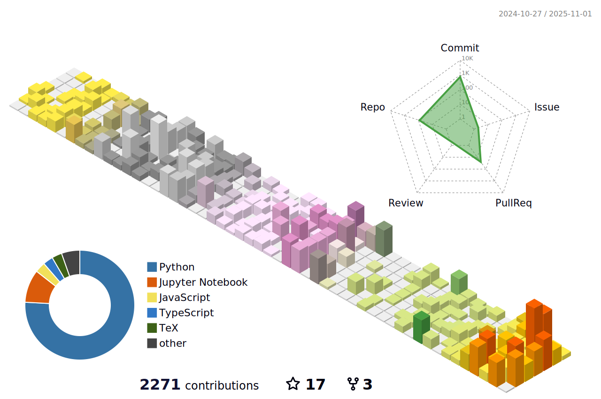

<h1 align="center">Christian H. Cooper</h1>

<!-- Profile 3D Contribution -->
<p align="center">
  
</p>

<!-- Animated Header Banner -->
<p align="center">
  <a href="https://github.com/HarleyCoops">
    
  </a>
</p>

<h3 align="center">Working on complex problems in a complex world</h3>

<!-- Profile Views Counter -->
<p align="left">  </p>

<!-- GitHub Trophies - Achievements showcase -->
<p align="left"> <a href="https://github.com/ryo-ma/github-profile-trophy"></a> </p>

<!-- Social Media Badges -->
<p align="left">
  <a href="https://twitter.com/christiancooper" target="blank"></a>
  <a href="https://linkedin.com/in/christianhcooperus" target="blank"></a>
</p>

<!-- About Me Section -->
## About Me

- I'm currently working on **AI-driven financial analysis tools**
- I'm currently learning **Python, PyTorch, Langchain**
- Ask me about **CFA training, Derivatives, Congressional Trading**


<!-- Current Projects Section -->
## Current Projects

<a href="https://github.com/HarleyCoops/Math-To-Manim">
  
</a>

<a href="https://github.com/HarleyCoops/OneShotGRPO">
  
</a>

<a href="https://github.com/HarleyCoops/smolThinker-.5B">
  
</a>

<a href="https://github.com/HarleyCoops/StoneyNakoda">
  
</a>

<!-- GitHub Stats Section - Using reliable endpoints -->
## GitHub Stats

<!-- GitHub Streak Stats - More reliable API -->
<p align="center">
  
</p>

<!-- GitHub Stats Card with custom parameters -->
<p align="center">
  
</p>

<!-- Most Used Languages - Alternative endpoint -->
<p align="center">
  
</p>

<!-- GitHub Metrics Dashboard - Using a different service -->
<p align="center">
  
</p>

<!-- Quantitative Finance Visualization -->
## Quantitative Finance Visualizations

<p align="center">
  <a href="https://github.com/HarleyCoops/Math-To-Manim">
    
  </a>
  <br>
  <em>Volatility Surface Visualization - Options Skew Model</em>
</p>

<p align="center">
  <a href="https://github.com/HarleyCoops/Math-To-Manim">
    
  </a>
  <br>
  <em>Recursive Rhombicosidodecahedron - A complex Archimedean solid where each vertex is itself a rhombicosidodecahedron. This fractal-like structure presents significant computational challenges for LLMs to render mathematically, requiring precise coordinate transformations across 62 faces (20 triangles, 30 squares, 12 pentagons) at multiple recursive scales.</em>
</p>

<!-- Programming Languages -->
<h3>Programming Languages</h3>
<p>
  
  
  
</p>

<!-- Frameworks & Libraries -->
<h3>Frameworks & Libraries</h3>
<p>
  
  
  
  
  
</p>

<!-- Cloud & DevOps -->
<h3>Cloud & DevOps</h3>
<p>
  
  
  
  
  
</p>

<!-- Hugging Face Models & Datasets -->
## Public models on Hugging Face

<p align="left">
  <a href="https://huggingface.co/HarleyCooper">
    
  </a>
</p>

As of Oct 2025: **6 models / 4 datasets / 6 Spaces**. Below are the ones reviewers should try first:

| Model (HF) | Focus | Base |
|---|---|---|
| **Qwen.5B-OpenR1Math** | Reasoning on math steps & answers (Open-R1 style) | Qwen/Qwen2.5-0.5B-Instruct |
| **Qwen.5B-GSM8K** | Small-model math finetune (GSM8K emphasis) | Qwen/Qwen2.5-0.5B-Instruct |
| **GRPOtuned / GRPOtuned2** | GRPO experiments on 0.5B LLMs | Qwen/Qwen2.5-0.5B-Instruct |

**Direct links:**
- Models: <a href="https://huggingface.co/HarleyCooper/Qwen.5B-OpenR1Math">Qwen.5B-OpenR1Math</a>, <a href="https://huggingface.co/HarleyCooper/Qwen.5B-GSM8K">Qwen.5B-GSM8K</a>, <a href="https://huggingface.co/HarleyCooper/GRPOtuned">GRPOtuned</a>, <a href="https://huggingface.co/HarleyCooper/GRPOtuned2">GRPOtuned2</a>
- Datasets: <a href="https://huggingface.co/datasets/HarleyCooper/synthetic_stoney_data">synthetic_stoney_data</a>, <a href="https://huggingface.co/datasets/HarleyCooper/StoneyNakoda">StoneyNakoda</a>
- Spaces (demos): <a href="https://huggingface.co/spaces/HarleyCooper/deepsitecoder">deepsitecoder</a>, <a href="https://huggingface.co/spaces/HarleyCooper/StoneyApp">Stoney-1</a>, <a href="https://huggingface.co/spaces/HarleyCooper/AskAboutCIL">Ask About Stoney</a>

**Quickstart (try a model in 5 lines):**
```python
from transformers import AutoTokenizer, AutoModelForCausalLM
import torch
mdl = "HarleyCooper/Qwen.5B-OpenR1Math"  # switch to any of your model IDs
tok = AutoTokenizer.from_pretrained(mdl)
model = AutoModelForCausalLM.from_pretrained(mdl, torch_dtype=torch.float16, device_map="auto")
print(tok.decode(model.generate(**tok("Solve: 13*17", return_tensors="pt").to(model.device), max_new_tokens=64)[0], skip_special_tokens=True))
```

---

<!-- Connect with me section -->
<h3 align="left">Connect with me:</h3>
<p align="left">
<a href="https://dev.to/harleycoops" target="blank"></a>
<a href="https://twitter.com/christiancooper" target="blank"></a>
<a href="https://linkedin.com/in/christianhcooperus" target="blank"></a>
<a href="https://kaggle.com/christianhcooper" target="blank"></a>
</p>

<!-- Footer -->
<p align="center">
  
</p>
